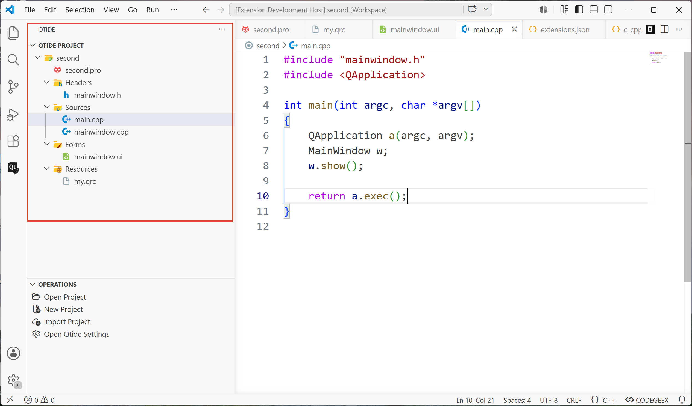

# Qtide

[English](README.md)

Qtide 是一个 VS Code 扩展，用于解析和浏览 Qt `.pro` 项目文件，提供类似 Qt Creator 的项目文件树视图。

### 功能

- **导入 .pro 项目** — 通过文件选择器导入 Qt `.pro` 文件，自动解析 TARGET、SOURCES、HEADERS、FORMS、RESOURCES
- **项目文件树** — 在侧边栏以分组形式展示头文件、源文件、UI 表单和资源文件，支持展开/收起
- **工作区文件提示** — 导入成功后询问是否保存 `.code-workspace` 文件，支持自定义保存路径
- **打开工作区** — 通过 `.code-workspace` 文件切换 VS Code 工作区
- **设置面板** — 提供分组式设置界面（General / Editor / Build），当前为功能预览


### 使用

1. 点击 Operations 视图中的 **Import Project**
2. 选择一个 `.pro` 文件
3. 项目文件树自动在下方显示
4. 按提示保存工作区文件（可选）

### 鸣谢

感谢 [eide](https://github.com/github0null/eide) 项目，本项目的实现参考了其设计和代码。

### 构建

```bash
# 编译扩展
npm install
npm run compile

# 构建设置面板（需先安装 Node.js）
cd webview/settings
npm install
npm run build
```

### 许可

MIT
